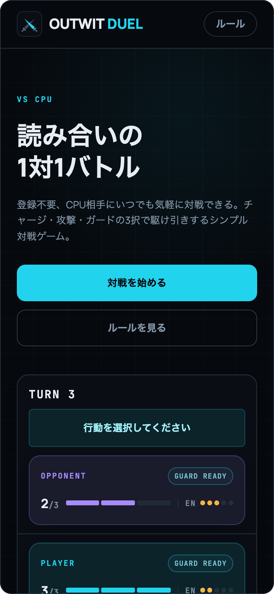
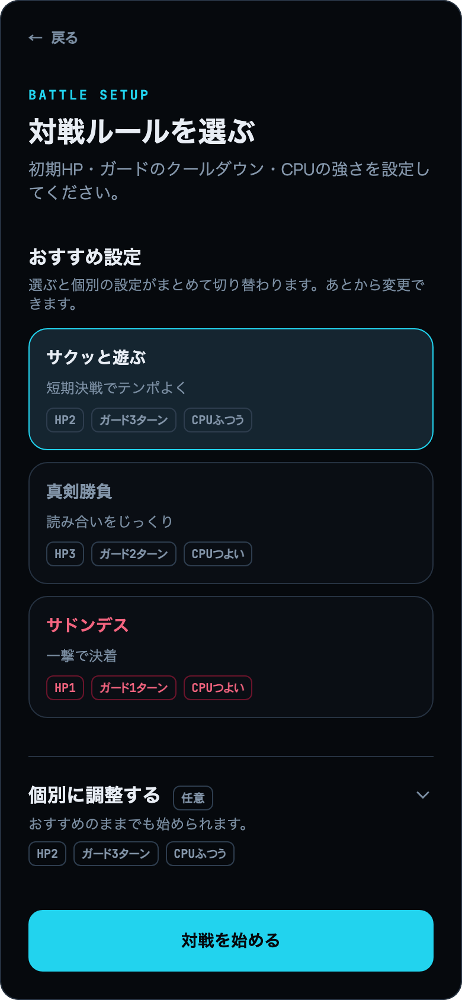
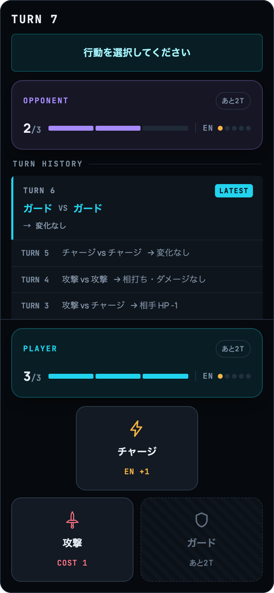

# OUTWIT DUEL

[](https://github.com/tnakamura0/1v1-battle-game/actions/workflows/ci.yml)

チャージ・攻撃・ガードの3択で駆け引きする、CPU対戦の1対1バトルゲームです。

**▶ [1v1-battle-game-ecru.vercel.app](https://1v1-battle-game-ecru.vercel.app)** — 登録不要、ブラウザだけで遊べます。

<p align="center">
  
  
  
</p>

## 遊び方

毎ターン、お互いが3つの行動から1つを選び、**同時に公開されます**。相手のHPを0にすれば勝ちです。

**ダメージが発生するのは、片方が攻撃・もう片方がチャージのときだけです。**

| 自分 \ 相手 | チャージ | 攻撃 | ガード |
| --- | --- | --- | --- |
| **チャージ** | — | 自分に1 | — |
| **攻撃** | 相手に1 | —（相打ち） | —（ガードされる） |
| **ガード** | — | —（ガード成功） | — |

行動にはそれぞれ制約があります。

- **チャージ** — エネルギーを+1します。エネルギーが最大（5）のときは選べません
- **攻撃** — エネルギーを1消費します。エネルギーが0のときは選べません
- **ガード** — 相手の攻撃を防ぎます。相手のエネルギーが0のときは選べません。成功するとエネルギーが+1されます。使用後は設定したターン数だけ再使用できません

つまり、**無防備になるのはチャージのターンだけ**です。とはいえエネルギーの主な供給源もチャージなので、溜めなければ攻撃の弾が尽きます。どこで溜め、どこで撃ち、どこでガードを切るかが、このゲームの読み合いになります。

対戦前に、初期HP（1〜3）・ガードのクールダウン（1〜3ターン）・CPUの強さ（ふつう / つよい）を選べます。組み合わせたおすすめ設定として「サクッと遊ぶ」「真剣勝負」「サドンデス」を用意しています。

## 技術スタック

- [Vite](https://vite.dev/) + [React](https://react.dev/) (SPA) + TypeScript
- [Tailwind CSS](https://tailwindcss.com/)
- [react-router](https://reactrouter.com/)
- [Vitest](https://vitest.dev/) + [Testing Library](https://testing-library.com/)
- ESLint + Prettier
- Docker（開発環境）
- GitHub Actions（CI: lint / typecheck / test / build）
- Vercel（ホスティング）

バックエンドはなく、対戦のロジックはすべてブラウザ上で完結します。

## 設計のポイント

### CPUの思考ルーチン

[`src/game/cpu.ts`](./src/game/cpu.ts)

**ふつう**は、合法手それぞれに基礎重み1を置き、盤面の条件で倍率を掛けて抽選します（エネルギーが0ならチャージを×4、相手のHPが1以下なら攻撃を×3、など）。

**つよい**は、相手の行動分布を予測したうえで、自分の合法手ごとに1ターン先の期待値を計算し、softmax（温度1.5）で抽選します。最善手を決め打ちにしないのは、**固定すると読まれて同じ手で嵌められる**ためです。

盤面の評価は、専用のシミュレータではなく**実際のルール（`resolveTurn`）を回した結果の差分**から求めています。おかげでガード成功時の+1エネルギーやエネルギー上限といった仕様が、評価側に書き写すことなく自動的に反映されます。

評価は4項目の線形和になっています。

| 項目 | 重み |
| --- | --- |
| 与ダメージ − 被ダメージ | 10（勝敗を決める一撃は1.5倍） |
| エネルギーの増減の差 | 2.5 |
| ガードのテンポ（クールダウンの長さに比例） | 1ターンあたり1.5 |
| **解決後に自分が選べる手の数** | 2 |

最後の項がないと、**CPUは自分を動けない状態に追い込む手を避けられません**。導入前の実測では、CPUが受けたダメージの **62.6%** が「合法手が1つしかない局面」で起きていました。典型は、ガードのクールダウン中にエネルギーを使い切ってチャージ一択になった状態で、相手から見れば的でしかありません。専用の分岐を書かずに、この1項だけで「ガードを切る判断」と「最後の1エネルギーを使う判断」の両方が改善します。

相手の予測は、合法手の一様分布に**行動履歴の出現頻度**（直近ほど重い）を混ぜ、さらに盤面から読み取れる動機で補正して作ります（あと1発で負ける相手はガードを選びやすい、こちらがガードできないターンは相手が安心して攻撃してくる、など）。ここで、**選択肢が1つしかなかったターンは数えません**。数えると「エネルギーが尽きるたびに強制されたチャージ」を相手の癖だと誤読してしまうためです。

### CPUの強さをテストで固定する

[`src/game/cpu.test.ts`](./src/game/cpu.test.ts)

評価の重みを手計算で検証するのではなく、**シード固定の対戦シミュレーションの成績そのもの**をテストにしています。9つのルール組み合わせ（初期HP3通り × クールダウン3通り）について、それぞれ200戦を回します。

相手は2種類です。

- **攻略法役** — 実際にプレイして報告された戦法（溜めておいて、相手がガードできないターンに撃つ）
- **ランダム役** — 合法手から一様に選ぶ

そのうえで、次のようなしきい値を表明しています。

- 「ふつう」は攻略法に対して勝率0.3未満 ／ 「つよい」は0.6超
- ランダム相手に「つよい」は勝率0.65超

初期HP1（サドンデス）だけは、この2つを 0.4 / 0.6 に緩めてあります。1発で決着するので読みの差が勝敗に反映される機会が1回しかなく、運の比重が上がるためです。さらに既定ルールでは、決着ターン数の中央値が15未満であることも確かめています（強くした結果、読み合いが噛み合って終わらなくならないこと）。

**「つよい − ふつう」の差だけでなく、絶対値でも表明している**のが要点です。差だけを見ると、両者が拮抗する相手では乱数のゆらぎに埋もれて実質何も検証しないテストになります。実際 hp1/cd3 でシード帯を変えながら200戦ずつ測ると、勝ち数の差は −1 / +15 / +5 / +14 / +14 と符号ごと揺れます（平均は +9）。そこでこの比較だけは600戦に広げています。

結果として、**強さの変化がテストの成績として表に出る**状態を保てています。逆に、窓の狭い値に追い込まないようにも気を配りました。たとえば「選択肢の数」の重みは、テストが通る範囲 [1.75, 2.5] のほぼ中央の 2 を採っています。特定のシードにたまたま当てはまる値を選ばないためです。

### Claude Code向けの開発基盤

このリポジトリは Claude Code での開発を前提に、規約を人間の記憶ではなく**機械で守らせる**形にしています。

- [`.claude/skills/`](./.claude/skills/) — `/new-issue-bug` `/new-issue-feature` `/new-pr`。Issue・PRのテンプレートを埋め込んだスラッシュコマンド
- [`.claude/hooks/`](./.claude/hooks/) — ブランチ命名規則とPRタイトル・本文の機械チェック。規約に反していると `git checkout -b` / `git switch -c` と `gh pr create` の実行自体がブロックされます
- [`CLAUDE.md`](./CLAUDE.md) と [`docs/`](./docs/) — 開発フローとコーディング規約
- [git-cliff](https://git-cliff.org/) — Conventional Commits から CHANGELOG とバージョンを自動生成

個人開発なのでレビューの必須Approve人数は設定せず、**このフックによる機械チェックをレビューの代替ゲート**にしています。

## セットアップ

[Docker](https://www.docker.com/) がインストールされていれば、ホストにNode.jsを入れる必要はありません。

```bash
docker compose up
```

`http://localhost:5173` で開発サーバーにアクセスできます。ソースコードの変更はホットリロードされます。

lint・typecheck・test・buildなどその他のコマンドは、コンテナ内で実行します。

```bash
docker compose run --rm app npm run lint
docker compose run --rm app npm run typecheck
docker compose run --rm app npm run test:run
docker compose run --rm app npm run build
```

## ドキュメント

- [docs/development-flow.md](./docs/development-flow.md) — ブランチ戦略、Issue/PR運用、リリースフロー
- [docs/coding-conventions.md](./docs/coding-conventions.md) — ディレクトリ構成、スタイリング、テストの方針

## ライセンス

[MIT](./LICENSE)
